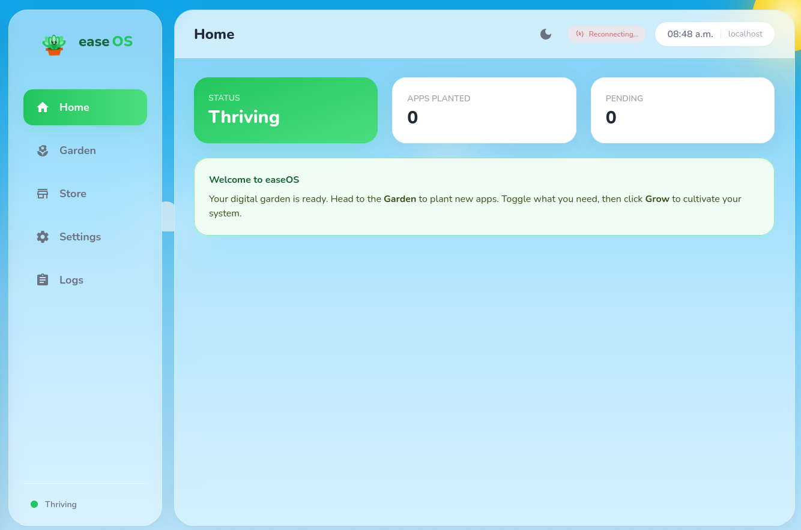
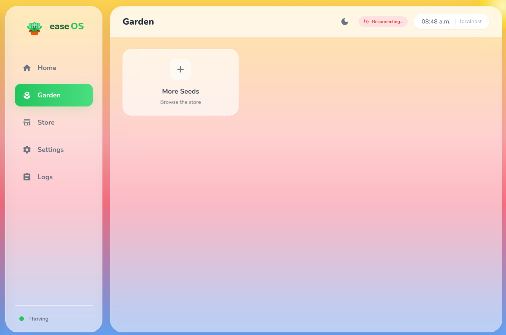
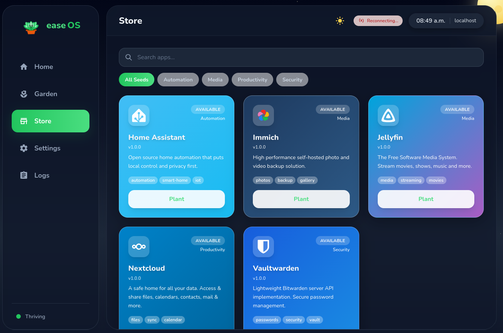

# easeOS

<p align="center">
  
</p>

**A home server you can set and forget.**

Install it once. Add your apps. Stop worrying about it. If something breaks, easeOS notices and fixes it. If an update goes wrong, it rolls back automatically.

<p align="center">
  
  
  
</p>

---

<p align="center">
  
  
  
</p>

---

## The Garden Philosophy

- **Drought Resistant** — Your data stays local. When the internet goes down, you keep working.
- **Self-Healing** — Corrupted file? easeOS fixes it automatically from a snapshot.
- **Transparent** — Open source, observable, yours.

---

## The Garden UI

No terminal required. Everything happens through the web interface at `http://<ip>:1234`.

- **Home** — System vitals at a glance. Status, uptime, pending changes.
- **Garden** — Your planted apps. Toggle what's growing, click **Apply** to cultivate.
- **Seed Store** — One-click installs: Immich (photos), Nextcloud (files), Jellyfin (media), Home Assistant, Vaultwarden.
- **Settings** — Network, hostname, users. Change it here, easeOS rebuilds itself.

---

## The Undo Button

Every change easeOS makes is reversible.

- **Auto-Rollback** — If an update breaks something, easeOS notices and reverts it. You get a notification, not a problem.
- **One-Click Undo** — After every Apply, a toast appears: *"Changes applied. [Undo]"*. Changed your mind? One click, done.

No restore process. No downtime. No stress.

---

## Why Not Docker / CasaOS / Umbrel?

They make containers pretty. But when an update breaks something, you're restoring backups and crossing your fingers.

easeOS is different. Built on NixOS, every change is atomic and reversible. Pick a previous state and you're back—instantly.

---

## What Powers It

- **NixOS** — Declarative, reproducible, atomic updates
- **Btrfs** — Self-healing filesystem with snapshots
- **TPM2** — Hardware-bound encryption, auto-unlocks on your device only
- **Tailscale** (coming soon) — Secure remote access without port forwarding

---

## Quick Start

```bash
git clone https://github.com/doughty247/easyos.git
cd easyos/easyos
./build-iso-docker.sh --vm      # test in QEMU
./build-iso-docker.sh --ventoy  # or copy to USB
```

Works on any x86_64 hardware: mini PCs, old laptops, NUCs.

---

## Roadmap

**Done:** Web UI, Seed Store, encryption, backups, self-healing

**Next:** ARM64/Pi 5, pre-built ISOs, Tailscale

---

## What's Next: Meet Cooper

We're building **Cooper**—a beautiful hardware companion for easeOS. A glowing *Haworthia cooperi* succulent that sits on your desk and shows your server's health at a glance. Green means healthy. Red means it needs attention.

No screen, no app, no checking. Just a plant that glows.


## Links

[Seed Store SDK](store/SDK.md) · [Issues](https://github.com/doughty247/easyos/issues) · [Discussions](https://github.com/doughty247/easyos/discussions)

MIT License
